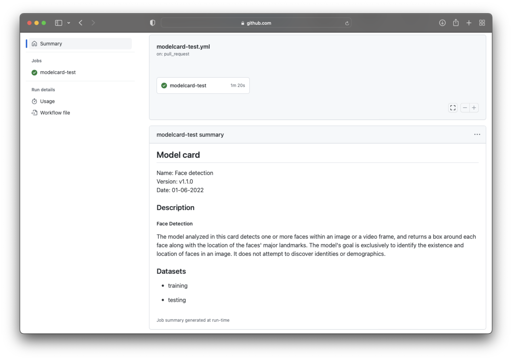

We are very happy to introduce [Modelcard-action](https://modelcards.compliancepal.eu) to help you maintain ML model's documentation up to date.

We created [Modelcard-action](https://modelcards.compliancepal.eu) for the following reasons:

1. Put the focus of collecting the ML model related documentation from the different stakeholders
2. Make it easy to push updates or address new concerns to everyone all at once
3. In a machine readable format

<!--truncate-->

## Why Modelcard-action?

Existing approaches for documenting the ML models are primarily aimed at creating the representation intended for end user consumption, following one of the following formats:

- Google's Model Card - [Kaggle](https://www.kaggle.com/code/var0101/model-cards), [Salesforce](https://blog.salesforceairesearch.com/model-cards-for-ai-model-transparency/), or [Hugging Face](https://huggingface.co/docs/hub/model-cards)
- IBM's [FactSheets 360](https://aifs360.mybluemix.net/)

## Getting up and running

```yml title=".github/workflows/validate.yml"
name: modelcard-test

on:
  pull_request:
    branches:
      - main
  workflow_dispatch:

jobs:
  file-exists:
    runs-on: ubuntu-latest
    steps:
      - name: Checkout branch
        uses: actions/checkout@v3

      - name: Check for model card file
        uses: CompliancePal/modelcard-action@main
        with:
          modelcard: modelcard.yaml
          rules: .modelcard/rules
```

## How does Modelcard-action works?

Modelcard-action is a monorepo written in Typescript, primarily as a wrapper around [Spectral](https://stoplight.io/open-source/spectral). Packaged as a Docker container, it is used as a Github [action](https://docs.github.com/en/actions/creating-actions/creating-a-docker-container-action). The general structure looks like:

```tree
modelcard-action
├── packages
│   ├── action
│   ├── functions
│   └── rulesets
```

The action works in this way:

1. Create a Spectral validator based on the [custom rules](/guides/custom-rules)
2. Validate the model card
3. Render the model card or provide annotations in GitHub action summary

The result of a model card rendering might look like the following, when the modelcard fulfills custom rulesets:



If there are validation problems, the problem report and annotations might look like:


## Community

We welcome your [contributions](https://github.com/CompliancePal/modelcard-action/blob/main/CONTRIBUTING.md) to Modelcard-action, whether you want to use it to document your ML models, you want to [contribute](https://github.com/CompliancePal/modelcard-action/blob/main/CONTRIBUTING.md) to the Modelcard-action core or just have questions. Follow us on [GitHub](https://github.com/CompliancePal/modelcard-action).

## Resources

- [Read our documentation](/index.html)
- [Follow us on GitHub](https://github.com/CompliancePal/modelcard-action)
