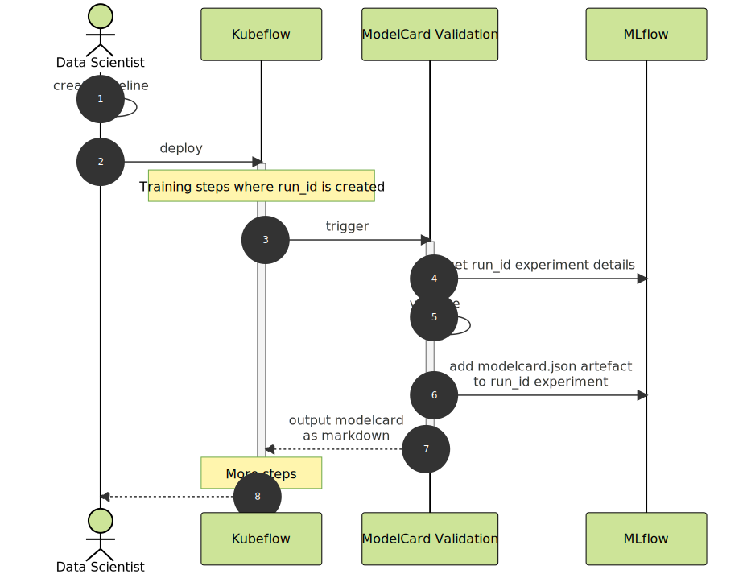

:::caution
The integration is experimental.
:::

## Overview

The integration takes as input the modelcard document tracked in git and augments it with with experiment information performed in a Kubeflow Pipeline and tracked in MLflow.

The integration relies on the [MLflow Tracking Server](https://www.mlflow.org/docs/latest/tracking.html#mlflow-tracking-servers) and the [Kubeflow Pipelines](https://www.kubeflow.org/docs/pipelines/overview/pipelines-overview/) to be installed and configured.

### Interaction



## Integration

### Modelcard CLI container

The integration is provided as a CLI tool in a container image. The container image is available on GitHub Container Registry:

```
ghcr.io/compliancepal/mc-kf:latest
```

### Container component

The integration needs [Kubeflow Pipelines SDK v2](https://www.kubeflow.org/docs/components/pipelines/v2/):

```bash
pip install --pre kfp~=2.0.0b1
```

Define the container component as a Python function, using the Pipelines SDK:

```python
from kfp import dsl

@dsl.container_component
def modelcard(run_id: str, tracking_uri: str, modelcard: dsl.InputPath(str)):
    return dsl.ContainerSpec(
        image="ghcr.io/compliancepal/mc-kf:latest",
        command=["modelcard", "kubeflow"],
        args=[
            "--run-id",
            run_id,
            "--tracking-uri",
            tracking_uri,
            "--modelcard",
            modelcard,
        ],
    )
```

### YAML component

Define the `Modelcard` component in a YAML file:

```yaml
name: Modelcard

description: Fills the model card template with experiment data from MLflow

inputs:
  - name: tracking_uri
    type: String
    description: MLFlow tracking uri where the training session will be saved
  - name: run-id
    type: String
    descripiton: MLflow experiment run id
  - name: modelcard
    type: LocalPath
    description: Path to the modelcard template file to be expanded with the experiment metadata

implementation:
  container:
    image:
    command:
      [
        'modelcard',
        'kubeflow',
        '--run-id',
        { InputValue: run-id },
        '--tracking-uri',
        { InputValue: tracking_uri },
        '--modelcard',
        { InputPath: modelcard },
      ]
```

<!-- ### Define the Kubeflow pipeline

```python
@dsl.pipeline(
      name='demo-pipeline',
      description='An example pipeline that performs addition calculations.',
)
def pipeline(
    ...
    mlflow_tracking_uri: str,
    ...
):
    # Task to train the model and track the experiment dat in MLflow
    # Must output the run_id
    train_task = train()

    # model card validation and augmentation
    modelcard_task = modelcard(
        run_id=train_task.outputs["run_id"],
        tracking_uri=mlflow_tracking_uri,
        modelcard="templates/modelcard.yaml"
    )
``` -->
