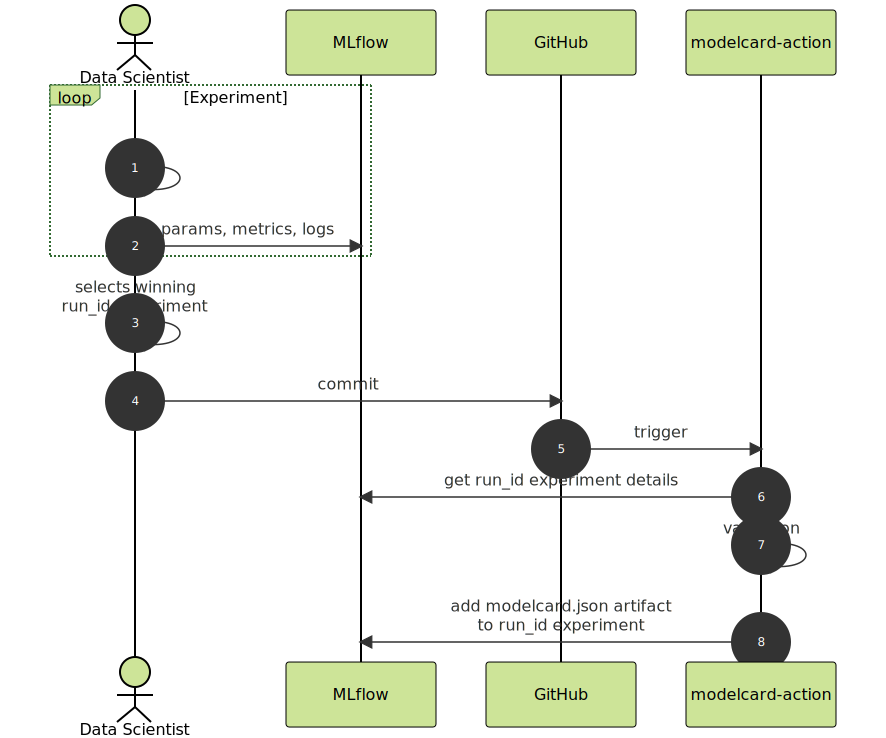
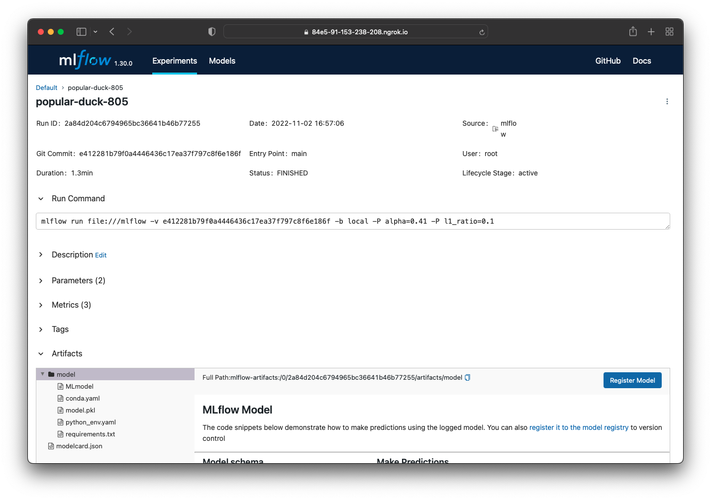

:::caution
The integration is experimental.
:::

:::tip
The integration expects that the MLflow Tracking Server has the proxied artifact storage access [enabled](https://www.mlflow.org/docs/latest/tracking.html#id32).
:::

## Overview

The integration takes as input the modelcard document tracked in git and augments it with with experiment information tracked by the MLflow server.

### Interaction

The _Data Scientist_ performs experiments in their development environment. The runs are tracked by the MLflow server (1-2). The winning experiment is selected by including the `run_id` in the model card document and making a new commit (3-4):

```yaml title="modelcard.yaml"
model_details:
  ...
  run:
    type: mflow
    id: 2a84d204c6794965bc36641b46b77255
...
```

GitHub triggers the **modelcard-action** and it receives the commit (5). The action fetches the run details from the MLflow server (6), performs validation (7), adds the augmented model card to experiment run as an artifact (8), and renders the model card.



## MLflow tracking server instance

### Run local test server

Using docker-compose is an effective way to start a MLflow tracking server. The example below is based on [mlflow-docker-compose](https://github.com/sachua/mlflow-docker-compose). The `web` service command starts the tracking server with the proxied artifact storage:

```yaml title="docker-compose.yml"
version: '3.7'

services:
  minio:
    restart: always
    image: minio/minio@sha256:d28c69eda85fb4c362d2a8976274da8f369398fc943b0c238c50722fd0c578c4
    container_name: mlflow_s3
    ports:
      - '9000:9000'
      - '9001:9001'
    command: server /data --console-address ':9001' --address ':9000'
    environment:
      - MINIO_ROOT_USER=${AWS_ACCESS_KEY_ID}
      - MINIO_ROOT_PASSWORD=${AWS_SECRET_ACCESS_KEY}
    volumes:
      - .cache/minio_data:/data

  mc:
    image: minio/mc@sha256:d281c2bfce56c727dc229643f8df99e24295fae586aaf6acb859eb2dd4c66ca4
    depends_on:
      - minio
    container_name: mc
    env_file:
      - .env
    entrypoint: >
      /bin/sh -c "
      /tmp/wait-for-it.sh minio:9000 &&
      /usr/bin/mc alias set minio http://minio:9000 ${AWS_ACCESS_KEY_ID} ${AWS_SECRET_ACCESS_KEY} &&
      /usr/bin/mc mb minio/mlflow;
      exit 0;
      "
    volumes:
      - ./wait-for-it.sh:/tmp/wait-for-it.sh

  db:
    restart: always
    image: mysql/mysql-server@sha256:fcbe88694872e88ae406bc69540211505eae922a182690d85be6af1a48e5ca0a
    container_name: mlflow_db
    ports:
      - '3306:3306'
    environment:
      - MYSQL_DATABASE=${MYSQL_DATABASE}
      - MYSQL_USER=${MYSQL_USER}
      - MYSQL_PASSWORD=${MYSQL_PASSWORD}
      - MYSQL_ROOT_PASSWORD=${MYSQL_ROOT_PASSWORD}
    volumes:
      - .cache/dbdata:/var/lib/mysql

  web:
    restart: always
    build: ./mlflow
    image: mlflow_server
    container_name: mlflow_server
    depends_on:
      - mc
      - db
    ports:
      - '5000:5000'
    environment:
      - MLFLOW_S3_ENDPOINT_URL=http://minio:9000
      - AWS_ACCESS_KEY_ID=${AWS_ACCESS_KEY_ID}
      - AWS_SECRET_ACCESS_KEY=${AWS_SECRET_ACCESS_KEY}
    # start the tracking server with proxied artifact storage
    command: >
      mlflow server 
        --backend-store-uri mysql+pymysql://${MYSQL_USER}:${MYSQL_PASSWORD}@db:3306/${MYSQL_DATABASE} 
        --artifacts-destination s3://mlflow/mlartifacts 
        --serve-artifacts 
        --host 0.0.0.0
```

The local test server can be exposed with [ngrok](https://ngrok.com), adding basic authentication:

```bash
ngrok 5000 --bind-tls true --auth user:password
```

The public url where the tracking server is available follows this format `https://{your-instance}.ngrok.io`.

## MLflow project configuration

The MLflow project needs to be developed in a Git repository stored on GitHub.

### Configure secrets

Add the MLflow tracking server as a GitHub secret:

```env
MLFLOW_TRACKING_URI=https://user:password@{your-instance}.ngrok.io
```

### Create workflow

Add the following workflow to your GitHub repository. The integration with the MLflow tracking server is enabled by the `MLFLOW_TRACKING_URI` environment variable.

```yaml title=".github/workflows/mlflow-integration.yml"
name: modelcard-test

on:
  pull_request:
    branches: [main]
  workflow_dispatch:

jobs:
  mlflow-modelcard:
    runs-on: ubuntu-latest
    steps:
      - name: Checkout branch
        uses: actions/checkout@v3

      - name: Check for model card file
        uses: CompliancePal/modelcard-action@mlflow-action-experiments
        env:
          MLFLOW_TRACKING_URI: ${{ secrets.MLFLOW_TRACKING_URI }}
        with:
          modelcard: modelcard.yaml
```

### Enhancing the experiment run artifacts

The **modelcard-action** adds the modelcard metadata document (e.g. `modelcard.json`) to the artifacts created during the tracked experiment run.


