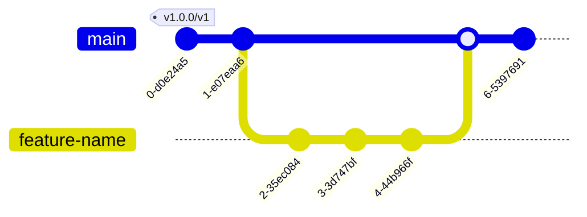

## Stage1

### Docker container build procedure

The docker container is built on each action run. The `action.yml` has the following content;

```yaml
---
runs:
  using: docker
  image: Dockerfile
```

### Development

New functionality is implemented using a feature branch that is created from `main`. Merging is done with a pull request that is reviewed and all test pass successfully.



### Release procedure

1. The commit is tagged with the new version `v{major}.{minor}.{patch}`.
2. The tag event triggers the workflow that moves the `v{major}` tag to the commit.


### Using the action

```yaml
- name: Check for model card file
  uses: CompliancePal/modelcard-action@<branch/tag>
  with:
    modelcard: modelcard.yaml
    rules: .modelcard/rules
```

## Stage 2: With pre-built container (DRAFT)


### Release procedure

When a new release `1.1.0` is created the `action.yml` file needs to be updated so that the image url points to the image built by the workflow.

```yaml
---
runs:
  using: docker
  image: 'docker://ghcr.io/compliancepal/modelcard-action:1.1.0'
```
