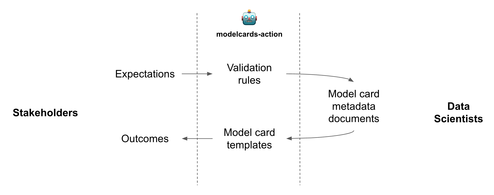
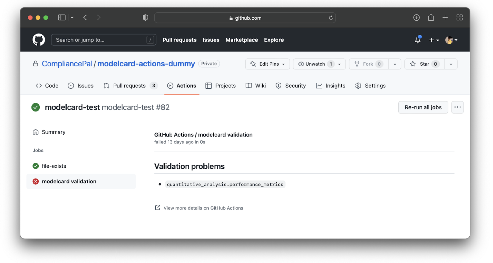
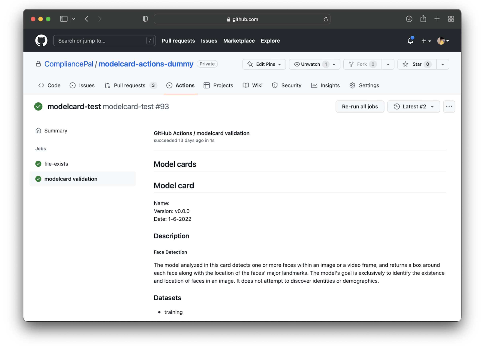

# Concepts

The development of machine learning technology includes disciplines like data engineering, data science and software engineering.

The data engineers are responsible with preparing the data. The data scientist are responsible with developing and training the ML model. The software engineers integrate the models into larger software systems and operate these systems.

When the machine learning technology is used in demanding application domains that require strong evidence for _traceability_, _data provenance_, or _risk management_, it is found that these concerns are often overlooked during development.

The **modelcard-action** ensures that the stakeholders' concerns and expectations are validated on every ML model change.

- **Validation rules** encode the the stakeholder's expectations as a set of [Spectral](https://meta.stoplight.io/docs/spectral) rules;
- **Model card templates** represent the blueprints for the stakeholder's expected outcomes, encoded as [Nunjucks](https://mozilla.github.io/nunjucks/) documents;
- **Model card metadata document** is a YAML document authored by the data scientist, together with other team members that represent the stakeholder's interest.

Deeply integrated with GitHub Actions, the **modelcard-action** is able to provide feedback if validation fails:

or render the model card, if validation succeeds:

